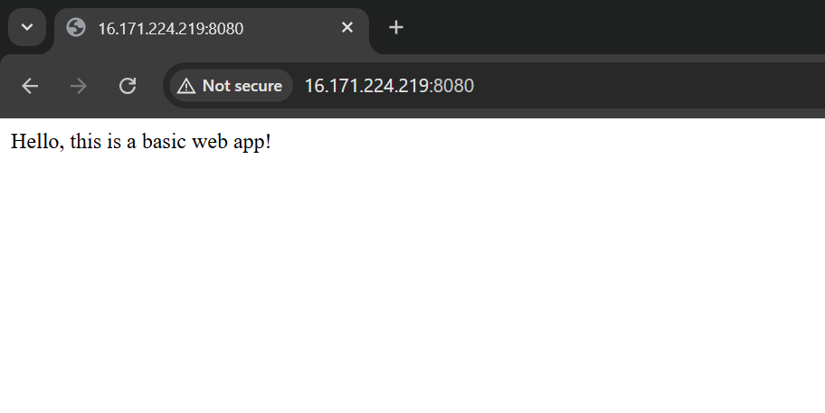
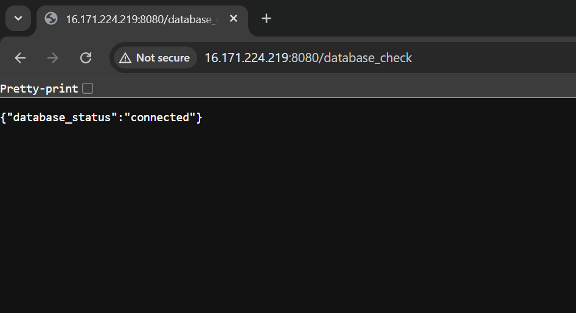

# Automated Two-Tier Web Application Deployment on AWS with Terraform

## 📌 Project Description

This project demonstrates a fundamental **DevOps workflow** for deploying a **two-tier web application** on **Amazon Web Services (AWS)**.

The infrastructure is defined as code using **Terraform**, which provisions:

* A **Virtual Private Cloud (VPC)**
* **Public and private subnets**
* An **EC2 web server**
* A managed **PostgreSQL RDS database**

The **application** is a simple **Python Flask web server** that serves a basic web page and includes an endpoint to test the database connection.

Deployment is fully automated via a **shell script** that:

* Copies the application code
* Installs dependencies
* Manages the application lifecycle on the EC2 instance

---

## 🛠 Skills Showcased

* **Infrastructure as Code (IaC):** Terraform to manage/provision cloud resources
* **Cloud Computing:** AWS services (EC2, RDS, VPC, Security Groups)
* **DevOps Automation:** Automated deployment with a single script
* **Networking:** Secure subnet and security group configuration

---

## 🏗 Architecture

The project follows a **two-tier model**:

* **Web Tier:**

  * EC2 instance running Flask
  * Located in a **public subnet**
  * Accessible via a **public IP**

* **Database Tier:**

  * RDS PostgreSQL database
  * Located in a **private subnet**
  * No public IP (accessible only to EC2 instance)

---

## ✅ Prerequisites

Before running the project, ensure you have:

* AWS Account with valid credentials configured
* **Terraform** installed locally
* **Python 3** and **pip** installed
* **Git** installed
* A private **SSH key file (.pem)** for EC2 access

---

## 🚀 Deployment

### 1. Clone the Repository

```bash
git clone https://github.com/YourUsername/your-repo-name.git
cd your-repo-name
```

### 2. Provision the Infrastructure

```bash
terraform init
terraform apply
```

Type **yes** when prompted.
This creates the VPC, subnets, EC2 instance, RDS database, and security groups.

### 3. Deploy the Application

```bash
chmod +x deploy_app.sh
./deploy_app.sh
```

⚠️ Make sure to replace placeholder names in the script with your correct **key file** and **project names**.

---

## 🌐 Usage

* **View Website:** Open your EC2 instance’s public IP in a browser
* **Database Check:**

  ```http
  http://[EC2_PUBLIC_IP]:8080/database_check
  ```

  Confirms the Flask app can connect to the database

---

## 📸 Screenshots




---

## 🧹 Clean Up

Destroy provisioned resources to avoid extra charges:

```bash
terraform destroy
```

Type **yes** when prompted.
